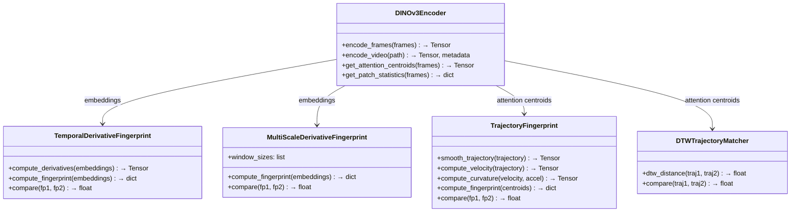

# Experimental Video Retrieval

Video deduplication and retrieval using **non-semantic signals**. Semantic embeddings alone can't distinguish videos that share content but represent different recordings — this project explores signals that capture *how* a video moves through content space, not just *what* it contains.

## The Problem

Two cyclists record themselves biking through New York City. Both pass through Central Park, producing similar frame-level embeddings. A naive semantic deduplication system flags them as duplicates — but they're entirely different videos.

```
Cyclist A: Harlem → Central Park → Financial District
Cyclist B: Chelsea → Central Park → Queens
```

We need signals that capture **direction of travel**, **temporal sequence**, and **motion patterns** to tell them apart.

## Approach

This project extracts non-semantic fingerprints from video using DINOv3 vision transformer features, then compares them using trajectory analysis rather than raw embedding similarity.


### Fingerprinting Methods


| Method | Signal | Strength |
|--------|--------|----------|
| **Temporal Derivatives** | Rate and direction of embedding change between frames | Simple, fast; captures scene transition patterns |
| **Multi-Scale Derivatives** | Derivatives at multiple temporal windows (1, 5, 15, 30 frames) | Captures motion from fine-grained shake to coarse narrative |
| **Trajectory Fingerprint** | Velocity, acceleration, and curvature of attention centroid path | Interpretable motion signature from where the model looks |
| **DTW Matching** | Dynamic Time Warping on attention centroid trajectories | Handles videos of different lengths/speeds |

### Similarity Fusion

Non-semantic similarity is combined with a semantic baseline for robust matching:

```
final_similarity = α · semantic_sim(v1, v2) + (1 - α) · nonsemantic_sim(v1, v2)
```

## Architecture



## Project Structure

```
experimental_video_retrieval/
├── video_retrieval/
│   ├── models/
│   │   └── dinov3.py              # DINOv3 ViT with attention extraction
│   ├── fingerprints/
│   │   ├── temporal_derivative.py # Temporal derivative & multi-scale fingerprints
│   │   └── trajectory.py          # Attention trajectory & DTW fingerprints
│   └── utils/
│       └── video.py               # Video loading and frame extraction
├── experiments/
│   ├── test_fingerprints.py       # Real video fingerprint comparison
│   └── test_synthetic.py          # Synthetic trajectory validation
└── pyproject.toml
```

## Installation

```bash
pip install -e .

# With dev dependencies
pip install -e ".[dev]"
```

Requires Python 3.10+.

## Usage

### Compare two videos

```bash
python experiments/test_fingerprints.py \
    --video1 path/to/video1.mp4 \
    --video2 path/to/video2.mp4 \
    --device cuda
```

### Compare all videos in a directory

```bash
python experiments/test_fingerprints.py \
    --video-dir path/to/videos/ \
    --max-frames 300 \
    --sample-rate 2
```

### Run synthetic trajectory tests (no video files needed)

```bash
python experiments/test_synthetic.py
```

This generates a similarity matrix across synthetic motion patterns (linear, circular, zigzag, stationary) and validates that fingerprints correctly distinguish them.

### Programmatic usage

```python
from video_retrieval import DINOv3Encoder, TemporalDerivativeFingerprint, TrajectoryFingerprint
from video_retrieval.utils import load_video

encoder = DINOv3Encoder(weights_path="path/to/dinov3.pth", device="cuda")

frames, fps = load_video("video.mp4", sample_rate=5)
embeddings = encoder.encode_frames(frames)
centroids = encoder.get_attention_centroids(frames)

# Temporal derivative fingerprint
td = TemporalDerivativeFingerprint(derivative_order=1, window_size=1)
fp = td.compute_fingerprint(embeddings)

# Trajectory fingerprint
traj = TrajectoryFingerprint(use_velocity=True, use_curvature=True)
tfp = traj.compute_fingerprint(centroids)
```

## Dependencies

- PyTorch >= 2.0
- torchvision >= 0.15
- NumPy >= 1.24
- OpenCV >= 4.8
- PyAV >= 10.0
- SciPy >= 1.11
- matplotlib >= 3.7
